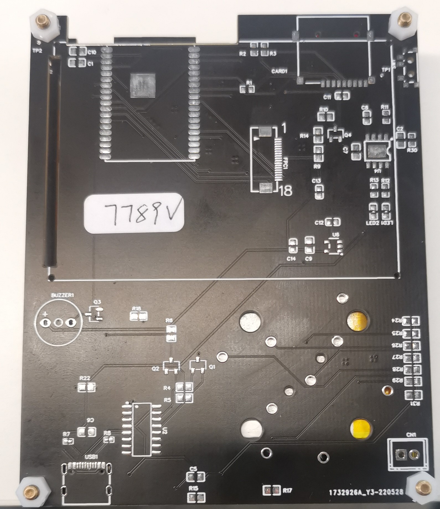

# 低成本基于ESP32的开源掌机硬件方案

## 立创 eda 开源链接

[基于esp32的retro-go开源掌机](https://oshwhub.com/piaoxuebingfeng/ji-yuesp32-diarduino-ruan-jian-bian-cheng-dines-mu-ni-qi-you-hu-ji_copy_copy_copy_copy_copy)

## 实物图片

